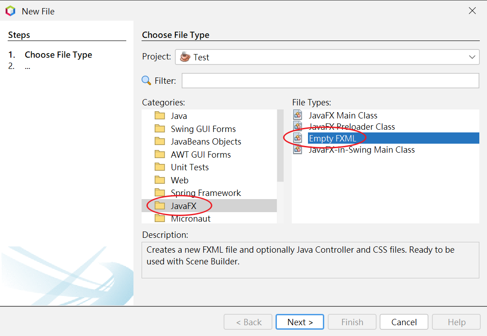

1. 下載NetBeans或[下載](https://netbeans.apache.org/front/main/download/nb24/)。
2. 下載JavaFX或[下載](https://gluonhq.com/products/javafx/)，Type選SDK，本次教學用17.0.13[LTS]版本，更高版本好像會報錯。
3. 下載Scene Builder或[下載](https://gluonhq.com/products/scene-builder/#download)
4. 打開NetBeans->Tools->Libraries
   
5. 如果打開的畫面是這樣:
   
   請開啟Tools->Options然後點擊Java讓他讀取後重新打開Libraries New Library就可以點擊了。
   

   
   
6. Library Name輸入JavaFX, Library Type選Class Libraries後點擊OK.
   
7. 在Classpath點擊旁邊的Add JAR/Folder
   
8. 把剛剛下載的JavaFX-sdk解壓縮後將/lib裡面的jar檔全部選取並加入
   
9. 點擊OK
   
10. 上方工具欄File->New project
    
11. Categories選擇Java with Ants -> 選擇Java Application後按下方的Next>調整名稱、位置、把Create Main Class取消勾選，完成後按Finish。
    
12. 在Project Name(旁邊有咖啡icon)按右鍵選擇最下面的Properties。
    
13. 選擇Libraries->點擊第二個"+" -> Add Library。
    
14. 找到剛剛加入的JavaFX Library並點擊下面的Add Library。
    
15. 點擊Run -> 點擊第一個"+" -> 點擊Add Library。
    
16. 找到剛剛加入的JavaFX Library並點擊下面的Add Library。
    
17. 點擊左側的Run->在VM Options添加--module-path "\path\to\javafx-sdk-23.0.1\lib" --add-modules javafx.controls,javafx.fxml，要把雙引號之間的路徑改為你剛剛下載javafx解壓縮後的資料夾內的lib位置->點擊OK。
    
    
18. 上方工具欄Tools->Options->點擊Java->JavaFX->Next->左下角方框打勾->點擊Install。
    
    
19. 上方工具欄Tools->Options->點擊Java->JavaFX->如果NetBeans有讀取到的話會顯示Default可以跳過此步驟。沒有讀到你的Scene Builder的話要自己導入。
    
    選擇Scene Builder安裝路徑->點擊OK。
    
20. 右鍵專案名稱(咖啡icon)->New->Other->JavaFX->JavaFX Main Class->Next。
    

    調整Class Name->Finish。
    
21. 右鍵專案名稱(咖啡icon)->New->Other->JavaFX->Empty FXML->調整FXML Name->Use Java Controller打勾後按Finish->收工。
    
    
    
